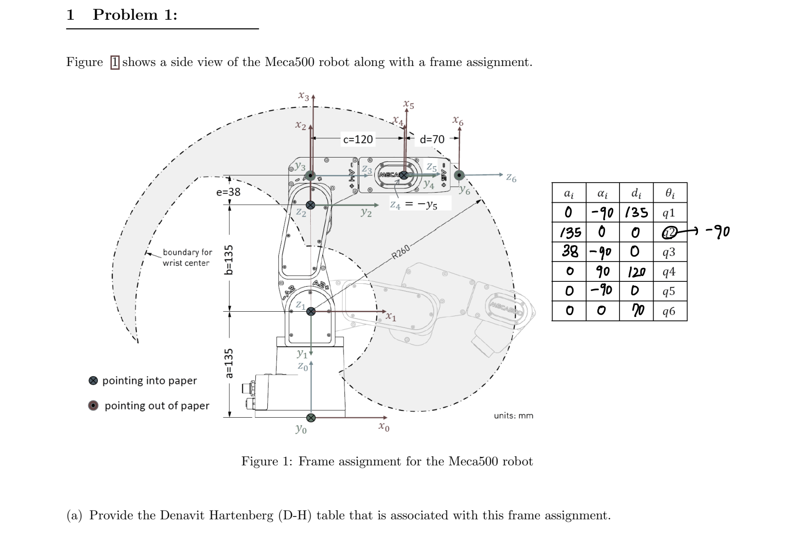

# Robot_joint_inference
robot angle to robot coordinate using 

## FR5 Model DH Parameters
This image provides the DH parameters for the FR5 robot. These parameters are the foundation for the kinematic calculations used to determine the robot's joint positions.

## FR5 Ontology Drawing
The second image provides a schematic view of the FR5 robot, showing its joints, links, and structure. This diagram aids in understanding the robot's design and the joint relationships.

## Meca500 DH Parameters
This third image illustrates the DH parameters for the Meca500 robot, which follows a similar kinematic structure but with different dimensions and configurations compared to the FR5 model.

## Aruco Marker Calibration
The final image shows the calibration setup with Aruco markers. These markers are used to assist with pose estimation and robot calibration, ensuring the accuracy of the robot’s movement in a physical environment.

